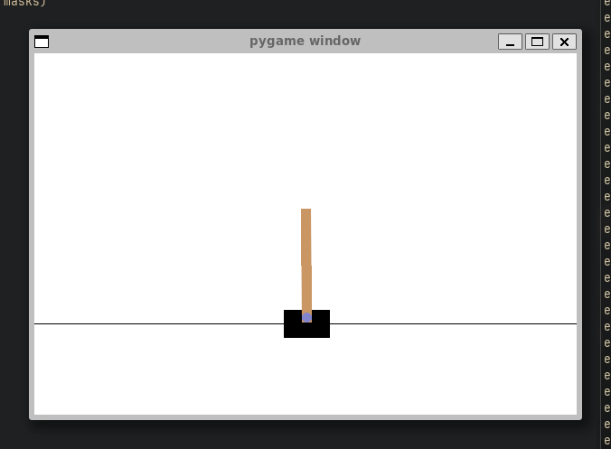
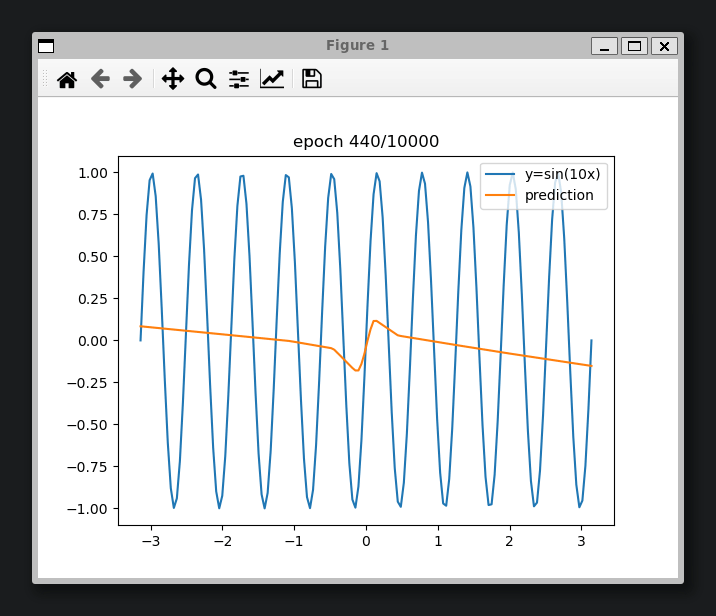

a small neural network library using only numpy 

example learning the CartPole RL environment (using [Gymnasium](https://gymnasium.farama.org/))

example learning y=sin(10x)

resources used:
- https://www.deeplearningbook.org
- https://karpathy.ai/zero-to-hero.html
